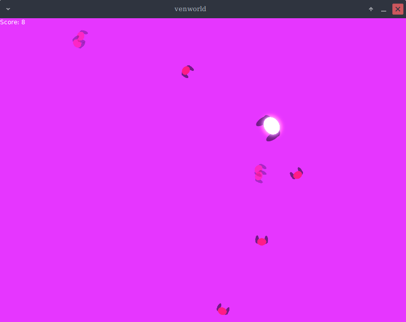

# venworld

A Game in 1 Hour

---

A small game made in 1 hour.

You can control a figure that moves around a screen as other figures spawn.

... There is a way to destroy the enemies.

---

---

# To Play

This is move with [love2d](https://love2d.org/).

Install it, and then open the latest `*.love` file in the Releases.

Or download the repository, and run `love .` in the repository root.

---

# Configuration

If you want to modify the controls, or make the game harder for yourself, then you can modify the `config.lua` file.

(If you have a `*.love` file, rename it to `*.zip` and extract it to modify the file, before rezipping it and renaming it back).

---

# License

See the [LICENSE.md](LICENSE.md) file.

Relies on the Public Domain library, [moonshine](https://github.com/vrld/moonshine/).
